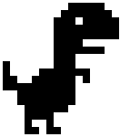
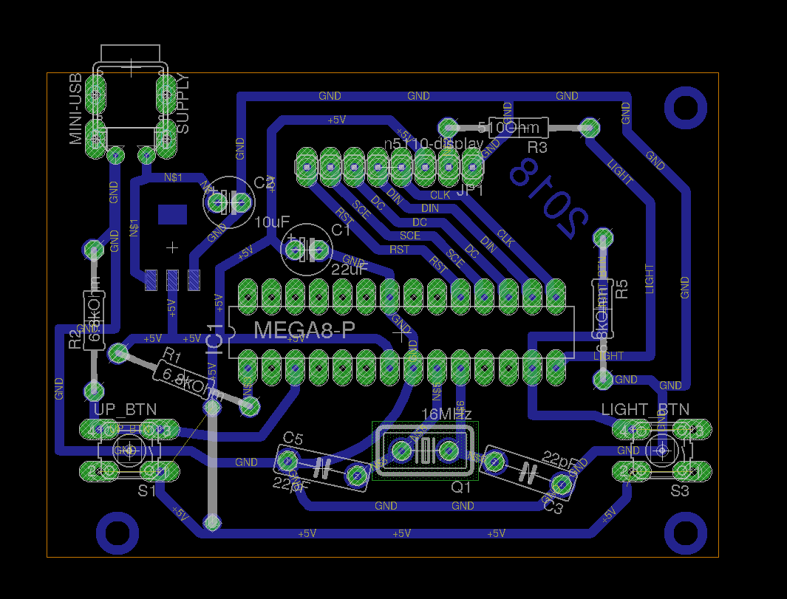
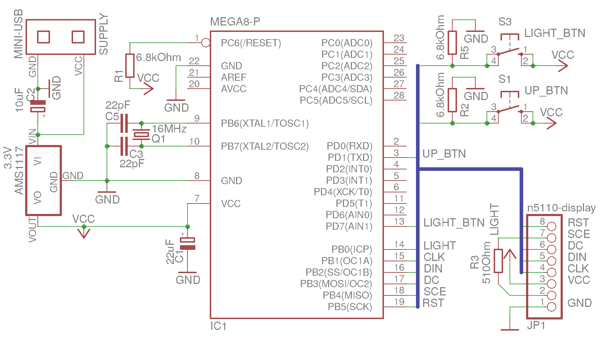

# Dino game

Firmware for **Atmega8A** microcontroller

# Notes
## Microcontroller
1. Set up your frequency **freq.h**, now it's **10 MHz**
2. Build project: `make`
3. Upload firmware: `make upload`
4. Configure external crystal oscillator with updating fuse bytes
## img_maker
If you want to generate custom hero or barrier use **./img_maker**
1. Install dependencies:
- [Pillow](https://pillow.readthedocs.io/en/latest/installation.html)
- [Python3](https://www.python.org/downloads/)
2. Run
`python3 ./img_maker/index.py YOUR_IMAGE.png`
3. Past generated code to **dino/dino.c** DINO_PIC or BARRIER_PIC
# Board

# Schematic

