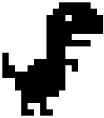
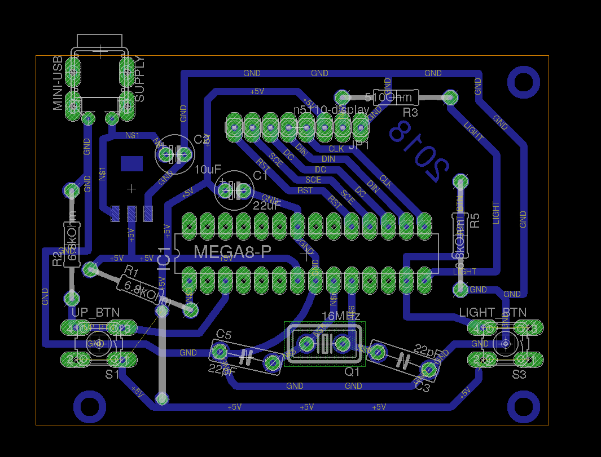
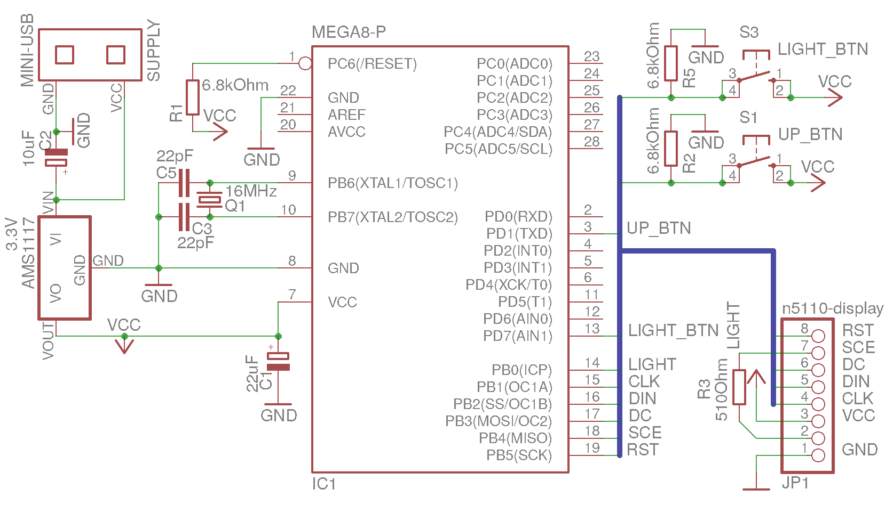

# Dino game


Firmware for **Atmega8A** microcontroller: the Chrome-style Dino runner game
on a Nokia 5110 (PCD8544) 84x48 LCD. The high score is stored in EEPROM.

# Build

Requires `gcc-avr` and `avr-libc`:

```sh
sudo apt-get install -y gcc-avr avr-libc
```

1. Set up your frequency in **freq.h**, now it's **10 MHz**
2. Build project: `make` (produces `dist/out.hex` and `dist/eep.hex`,
   prints a size report)
3. Upload firmware: `make upload` (avrdude with a USBasp programmer)
4. Configure external crystal oscillator with updating fuse bytes

# Tests

Host-side unit tests for the game logic (no AVR toolchain required):

```sh
make test
```

# Notes
## Controls
- **PD1** button — jump / start game (hold on the start screen to reset the
  high score)
- **PD7** button — toggle LCD backlight (LED on **PB0**)
## img_maker
If you want to generate custom hero or barrier use **./img_maker**
1. Install dependencies:
- [Pillow](https://pillow.readthedocs.io/en/latest/installation.html)
- [Python3](https://www.python.org/downloads/)
2. Run
`python3 ./img_maker/index.py YOUR_IMAGE.png`
3. Past generated code to **dino/dino.c** DINO_PIC or BARRIER_PIC
# Board



# Schematic


